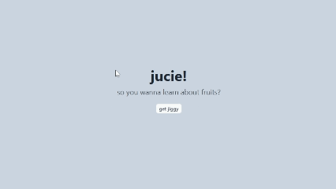

# 🧃 Jucie

Jucie is a clean and colorful mock juice shop website built as a responsive frontend project. It's designed to showcase modern UI/UX design principles while keeping things simple, fun, and engaging.
The purpose of this project is just to mess around with some light javascript, css, and gain a deeper understanding of starters like Netlify.

And also learn some interesting / random facts about fruits!

<div align="center">
  
</div>


---

## Features

- **Responsive Design** – Optimized for both desktop and mobile devices.
- **Modern UI** – Bright, bold visuals with a playful brand personality.
- **Simple Navigation** – Clear and intuitive layout to guide users through products and pages.
- **Reusable Components** – Structured and modular code for easier updates and scalability.

---

## Technologies Used

- **HTML** – Semantic structure and accessibility in mind.
- **CSS** – Custom styling with a focus on layout, animation, and responsiveness.
- **JavaScript** – Handles simple interactivity.
- **Figma (Design phase)** – Designed and prototyped visually before coding.


## How to Run

1. **Fork or clone** this repository:
```bash
git clone https://github.com/bianca-tm/jucie.git
```
2. Installation
```bash
npm i
```

3. Run the development server:

```bash
npm run dev
```
Open [http://localhost:3000](http://localhost:3000) with your browser to see the result.
